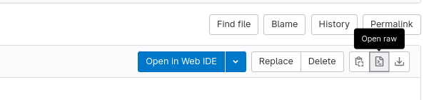

# oForest

This is the companion repository for the thesis that introduced oForest, a tool that streamlines and automates the deployment of [oTree](https://www.otree.org/) experiments on self-hosted infrastructure. oTree is a popular tool when it comes to creating digital, interactive and online capable experiments for conducting behavioral economics research. Due to conflicts with European General Data Protection Regulations though, it has become difficult to host oTree experiments with US cloud providers such as Heroku. As researchers are looking for alternatives, ideally research institutions themselves would be capable of providing such a deployment infrastructure. oForest uses containers, container orchestration and continuous integration pipelines, to provide researchers with an environment that is simple to use, where they can act autonomously and quickly, which is built on industry-standard tooling, which relies on a high level of automation. oForest gives institutions a fast way of creating an environment where researchers can deploy and conduct digital experiments. 

## Quick-Start Guide

This is the quick setup guide to creating the oForest deployment environment. To get started, make sure you match the following **requirements**.

- [ ] `ssh` access to an Ubuntu 22.04 server with a static IP address. Make sure no firewall blocks in- or outbound traffic to your server. Especially make sure the ports 80 (HTTP), 443 (HTTPS) and 22 (SSH) are not blocked.
- [ ] An account and empty project group on [GitLab](https://gitlab.com).
- [ ] Have [Ansible](https://ansible.com/) installed on your local computer, you can find an installation guide [here](https://docs.ansible.com/ansible/latest/installation_guide/intro_installation.html). 
- [ ] Be familiar with Git

As a first step, clone the oForest repository. The repository has the following structure:

```
oForest
|-  Ansible
	|-📁 cert-manager
	|-📁 gitLab-runner
	|-📁 observability
	|-📁 storage
	|- general-setup.yaml
	|- gitLab.yaml 
	|- inventory.yaml
	|- README.md
	 
|-  GitLab
	|-📁 template-experiment
	|-📁 pipeline
	 
|-  HelmChart
	|-📁 oTreeChart
		|-📁 templates
		|- chart.yaml
		|- values.yaml
```

The Ansible folder contains all the Playbooks and configuration files that are needed to create the oForest environment on the server. The GitLab folder contains two repositories that need to be uploaded to their own project as soon as an administrator has created a GitLab group. Last, the HelmChart folder contains all the Manifest templates, that are needed in deploying a new oTree experiment. 

## General Setup using Ansible

After you downloaded these files, open your terminal and navigate to the Ansible folder. Before running our first Playbook, we first need to add our server IP address and `ssh` user to the `inventory.yaml`. It should look similar to this.

```yaml
# inventory.yaml
cluster:
  hosts:
    vm01:
      ansible_host: 0000:0000:0000:::: # your IP here
      ansible_user: root # put your ssh user here 
```

After you are done, you can invoke the `general-setup.yaml` Playbook. **Before you continue, we encourage you to look at the file to understand what you are about to do.** An Ansible playbook is relatively self-explanatory. After that, you can start by running:

```bash
ansible-playbook -i inventroy.yaml general-setup.yaml
```

## Preparing GitLab

Installing all dependencies should only take a few moments, meanwhile, you can start setting up GitLab and the runners. oForest uses GitLab as its main user interface.

You will do:

- Generate GitLab Access Tokens for the Runners in the pipeline and for Helm
- Create a repository for packaged Helm Charts
- Create a repository for the CI/CD pipeline
- Create a repository for experiments to use as a template

### GitLab Runner
Go to the GitLab group, you created earlier, and use the left side menu to navigate to `CI/CD > Runners`. Click the blue "Register a group runner" button and copy the token. Store the token somewhere save, e.g. a password manager like [1Password](https://1password.com/de/) or [KeePass](https://keepass.info/). The token you just generated will be referred to as `runner-registration-token`.

### Access Tokens
Afterward, navigate to `Settings > Repository` and expand the *Deploy Token* section. Here, create three new tokens. **Attention! You will only be able to see the tokens once. Make sure to save them properly.**:

1. Call it `K8s read registry`, and the username `k8s-read-registry`. (You can also choose your own name here). Then tick the scope box that says `read_registry`.
2. Call it `Helm admin`, and the username `helm-admin`. Tick the boxes for `read_package_registry` and `write_package_registry`.
3. Call it `Helm read registry` and the username `helm-read-registry`.


### Setting Up a Helm Package Registry

oForest uses Helm to manage Kubernetes Packages. You can build your own Helm package and use it in your infrastructure. Besides a Container registry, GitLab also allows you to store helm charts. 

For this, you need to create a project in your oForest group that will hold your charts. After the creation, you need to copy the project ID right below the project name.

Now use your terminal to navigate to the Helm Charts folder. You will find a file called `oTree-[version].tgz` in there, this is a packaged Helm chart. We can use `curl` to push the packaged helm chart to the registry. If you deleted the packaged `.tgz` file or made changes to the Helm Chart to personalize it, you can rebuild it like so: 

```sh
helm package ./oTree
```

To push the package use the following command. Make sure to exchange the placeholders in the code below.: 

```bash
curl --request POST \ 
     --form 'chart=@oTree-0.1.3.tgz' \
     --user [token name]:[access token] \
https://gitlab.com/api/v4/projects/[YOUR PROJECT ID]/packages/helm/api/stable/charts
```
As `token name` and `access token`, you can use the token you generated above, i.e. *helm-admin*. 

If everything worked correctly you should end up with a repository that contains the oTree chart and is empty otherwise. You can navigate to `Packages and registries > Package Registry` to view the package you just pushed.

### Setting up the CI/CD Pipeline

Before you can use the CI/CD pipeline, you must first change the base domain and the Helm registry location. Change the base domain to the domain of your institution. Make sure a wildcard DNS entry points to your server. So every `https://*.yourdomain.de` should be redirected to the cluster. Second, change the Helm registry location to the one we created in the previous step. For this, you only need to copy the project ID and paste it into the placeholder. Both variables can be found in lines 3 and 4.

In the next step, you must create an empty project to which you then need to push the contents of the `pipeline` folder. For this navigate to the `pipeline` folder and run

```
git init
git add .
git commit -m "init"
git remote add origin [place the url of your project here]
git push origin
``` 

### Set up the Template Experiment

The template experiment folder can be used as a basis for new experiments. To make sure every experiment references the CI pipeline you set up in the previous step, open the `gitlab-ci.yaml` file and change the URL to the file in the repository you just created. You will find the link to the file by clicking on the file in the GitLab interface and then pressing the "open raw" button.



You should use this URL inside the CI file. After you added the file you can again run the following commands.

```
git init
git add .
git commit -m "init"
git remote add origin [place the url of your project here]
git push origin
``` 

## Returning to Ansible

Now that you have set up GitLab, we can continue with the last step, which is adding GitLab runners to the oForest cluster. Go to `gitLab-runner/gitLab-runner-secret.yaml` and edit both the `runner-registration-token` and `.dockerconfigjson`. As the `runner-registration-token` use the `base64` encoded registration token you generated earlier. **It is strongly discouraged to use an online encoder**. On Linux and Mac you can encode any string like this:

```bash
echo -n 'token' | base64
```

For the `.dockerconfigjson` token use the token with the name `K8s read registry` you generated earlier. It also must be `base64` encoded.

After you are done, you can now add the GitLab runner to your cluster by running the GitLab playbook like so:

```bash
ansible-playbook -i inventroy.yaml gitLab.yaml
```

This concludes the setup of the oTree environment. You can now invite researchers to the GitLab group. By forking the `template-experiment`, they can deploy their own experiments. For further instructions consult the `README.md` in the template repository.

If you want to understand the components of oForest, you can also find my thesis [here]("./Docs/Thesis/Cultivating an oForest—Operating a Scalable Experimentation Infrastructure for oTree.pdf").

